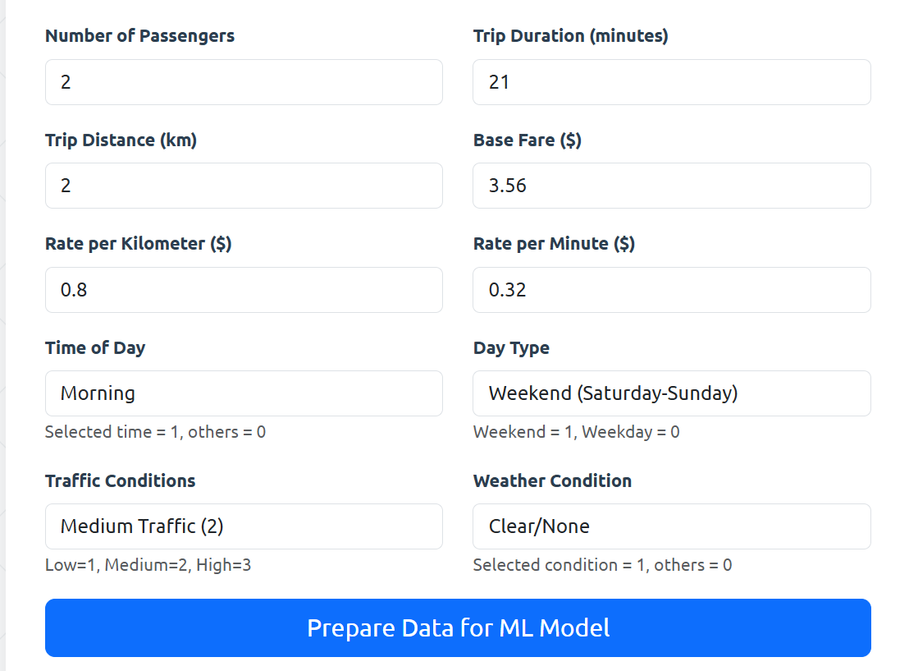
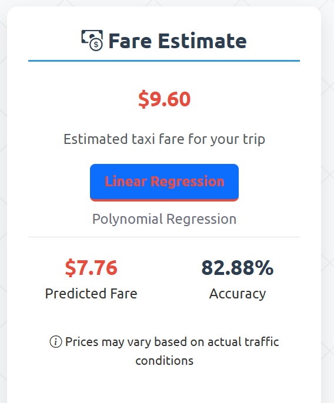
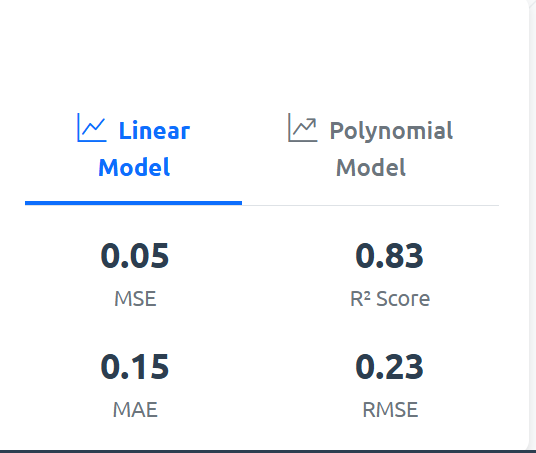

# Taxi Price Prediction - ML Project with Django UI

## Description
A machine learning project that predicts Taxi prices provides a user-friendly interface built with Django.

## Features
- Predict Taxi Price based on passenger input.
- Web-based UI using Django.
- Interactive and user-friendly input forms.
- Displays predictions along with model accuracy.

## Installation

1. Clone the repository:
```bash
git clone https://github.com/Faisal-Zamir/TaxiPricePrediction_dj_UI.git
```
2. Navigate to the project directory:

```bash
cd TaxiPricePrediction_dj_UI
```
3. Install required packages:
```bash
pip install -r requirements.txt
```
4. Run the Django server:
```bash
python manage.py runserver
```
5. Open your browser at:
```bash
http://127.0.0.1:8000
```
## Usage

To use the Student Performance Prediction application:

- **Step 1:** Fill in student details in the input form.
- **Step 2:** Click the **"Calculate Price"** button.
- **Step 3:** View the predicted price along with related metrics such as the accuracy.
---

## Dataset

The model is trained on a publicly available dataset from Kaggle:
Link: 
```bash
https://www.kaggle.com/code/pyfaisalzamir/taxi-price-predictions-with-linear-polynomial  
```
---

## Model

- **Algorithm:** Linear Regression & Polynomial Regression
- **R2:** 83% and 93%  

---

## Screenshots

For example:  

- **Home Page:** Screenshot of the form where users input student data.
  
- **Metrics (bottom area):** Screenshot showing the predicted results and metrics.
  
- **Model Metrics (bottom area):** Screenshot showing the predicted results and metrics.
  


**Contributing**

Feel free to open an issue or submit a pull request for improvements.

**Contact**

Faisal Zamir - pyFaisalZamir@gmail.com | JafriCode@gmail.com
GitHub: https://github.com/Faisal-Zamir
